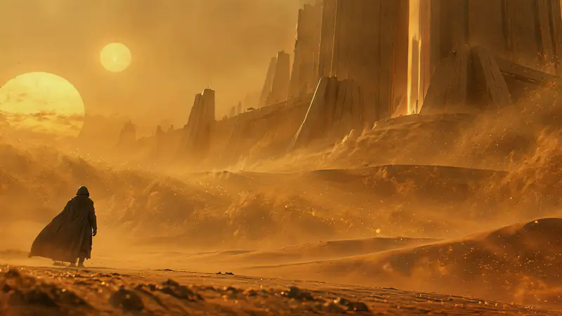
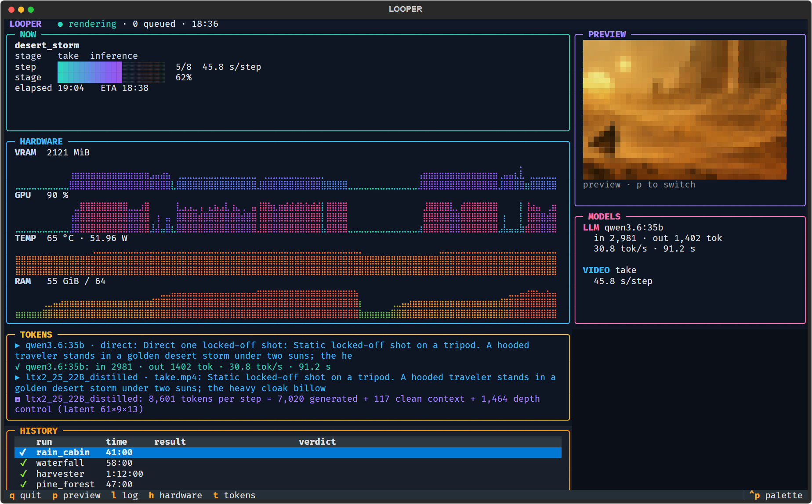

# worldloom

**One still image and a prompt in, a seamless cinematic 30–60 second video loop out — on a 6 GB laptop GPU.**

<p align="center">
  
</p>
<p align="center"><sub><b>This picture is the loop itself:</b> 27 seconds made from one still and a prompt on a 6 GB laptop
GPU, playing forever. Try to find where it starts. (Preview at 12 fps; the delivered loop is 24 fps 4K.)</sub></p>

The loop's last frame flows into its first, so the file can play for hours. Every loop starts from your still (or a
keyframe the director writes for you), moves the way you describe, and returns to its start through a *generated*
passage — never a cross-fade, never playback in reverse.

> **Status: research-grade.** It runs end to end, unattended, on the kinds of scenes it was developed on: rain on a
> cabin window, a jungle waterfall, a furnace and an industrial harvester, a fire-lit castle common room, and a cloaked
> figure standing in a desert storm. Expect to read the docs when a new kind of scene misbehaves.

## How it works

```
prompt [+ your still]
  -> director (local LLM): turns a prompt or a long brief into a render prompt; the contract checks it against your words
  -> [--motion-donor: a Hunyuan Video render of the still whose motion guides the take; re-rolled if a person walks off]
  -> take: LTX-2.5 image-to-video from the still, gated on slow drift (up to three seeds)
  -> long return: one generated passage from the take's end back to its own start
  -> closures + splice -> loop QC (seam, drift, freezes) -> review packet for a human
  -> [--4k, on a loop a human accepted: FlashVSR x4 in circular chunks -> an hour-long file by stream copy]
```

Three ideas carry the quality:

- **The closure is generated, not blended.** LTX renders the passage between the loop's end and its start from the
  real frames on both sides, so the join is new motion rather than two images dissolving
  ([ADR 0005](DECISIONS/0005-short-seamless-forward-loop.md), [0007](DECISIONS/0007-particle-content-closure.md)).
- **Give the return time.** A short bridge between two distant states churns; one long return (about 15 s) that drifts
  back gradually is invisible ([ADR 0012](DECISIONS/0012-long-return-closure.md)).
- **Borrow motion where the video model will not make it.** LTX keeps large cloth almost still; a Hunyuan Video render
  of the same still, used as a moving depth guide, makes a cloak billow while LTX keeps the look
  ([ADR 0016](DECISIONS/0016-motion-donor-route.md)).

Every stage writes its outputs and metadata to its own fingerprinted folder, so an interrupted run resumes where it
stopped and a changed setting re-renders only what it affects.

## Requirements

- **NVIDIA GPU with 6 GB+ VRAM and 64 GB system RAM.** Developed on an RTX 3060 Laptop (6 GB); an LTX take offloads
  the model to system memory and peaks near 60 GB.
- **[WanGP](https://github.com/deepbeepmeep/Wan2GP)** with these models: LTX-2.5 22B distilled (WanGP model `ltx2_25_22B_distilled`, every run);
  Hunyuan Video 1.5 480p step-distilled (`--motion-donor`); FlashVSR (`--4k`); Z-Image (keyframes for prompt-only
  runs). worldloom drives WanGP in-process and runs in **WanGP's own Python environment**.
- **For `--motion-speed` only:** Lightricks' LTX-2.5 Slow-Motion-Control LoRA
  (`ltx-2.5-22b-lora-slow-motion-control-1.0.safetensors`) in `<WanGP>/loras/ltx2/`; WanGP does not download it.
- **ffmpeg / ffprobe** on `PATH`.
- **[Ollama](https://ollama.com)** with `qwen3.6:35b` for the director — or skip the director with `--raw-prompt`, or
  use `--director claude` (the Claude Code CLI) for a hosted director.
- Tested on Windows 11. Linux should work but has not been tried.

## Install

```
git clone https://github.com/EvanWieland/worldloom.git
```

Put your WanGP checkout beside it (`../Wan2GP` or `../tools/Wan2GP`), or point `WANGP_ROOT` at it. Run everything
from the `worldloom` folder (the Python package inside is `looper`) with WanGP's Python (below: `$PY`, e.g. `../Wan2GP/.venv/Scripts/python.exe`).
The terminal dashboard needs two extra packages:

```
$PY -m pip install textual textual-image          # uv-managed venv: uv pip install --python $PY textual textual-image
```

Run the tests (fast, no GPU): `$PY -m unittest discover tests`.

## Quick start

```
# your still + how it should move (a scene without people)
$PY -m looper loop --image room.png --prompt "A low wood fire flickers in a stone hearth; a thin wisp of smoke rises." --run-id room

# a figure in wind: borrow the cloth motion from a donor render, at 0.6x its speed
$PY -m looper loop --image traveler.png --prompt-file brief.md --motion-donor --donor-speed 0.6 --run-id traveler

# slower motion everywhere (LTX's speed adapter)
$PY -m looper loop --image room.png --prompt "..." --motion-speed 0.5 --run-id room_slow

# no still: the director writes three keyframes and pauses for your pick
$PY -m looper loop --prompt "A jungle waterfall with mist" --run-id falls
$PY -m looper loop --prompt "A jungle waterfall with mist" --run-id falls --approve [--keyframe 2]

# finish in 4K (about 2.6 h per 30 s locally): the first --4k run stops at the review gate,
# you accept the loop after watching its review, and the same command again upscales it
$PY -m looper loop --image room.png --prompt "..." --run-id room --4k
$PY -m looper accept room loop
$PY -m looper loop --image room.png --prompt "..." --run-id room --4k
```

An interrupted run resumes with the same command. `$PY -m looper loop --help` lists every option (loop length,
seeds, resolution, settle behaviour, audition gate, ...).

## What a run produces

```
runs/<run-id>/
  manifest.json                     every stage's fingerprint
  events.jsonl                      every event the run emitted
  stages/<stage>/<fingerprint>/     each stage's outputs + stage.json (config, inputs, metadata)
    review/.../review.md, review.mp4    what to look at (timestamps), metrics, verdict; the loop played twice
    deliver/.../final.mp4               the loop, repeated
    deliver4k/.../loop_4k.mp4, final_4k.mp4
```

Watch a run live with `$PY -m looper dash` (terminal dashboard) next to `$PY -m looper hw` (GPU telemetry).

<p align="center"></p>

`$PY -m looper trace RUN_ID` writes a stage-by-stage comparison; `$PY -m looper prune` lists superseded outputs.

## Quality control

- **take_qc:** slow brightness drift per region of a 3x4 grid (pass at 4 grey; best effort up to 7.5) and camera
  stability. Only slow change breaks a loop; quick flicker is fine.
- **loop_qc:** the seam's frame step against the loop's own steps, region by region; whole-loop drift; motion that
  stalls at the joins (a calm lull passes, a freeze fails).
- **Review:** a human watches the joins at the listed timestamps; a content checklist from your own words (fire keeps
  burning, smoke keeps moving, ...). The 4K finish runs only on a loop a human accepted.

The thresholds and how they were calibrated against human verdicts are in [QUALITY.md](QUALITY.md).

## Documentation

- [ARCHITECTURE.md](ARCHITECTURE.md) — stages, artifacts, events, resumability.
- [QUALITY.md](QUALITY.md) — what "good" means, objective checks, gates.
- [DECISIONS/](DECISIONS/) — decision records; start with 0005, 0007, 0012 and 0016.
- [CLAUDE.md](CLAUDE.md) — working on the code with Claude Code: the invariants and the rules for changes.
- [research/](research/) — lab notes with measurements and the reviewer's verdicts. Good entry points:
  [ruled-out.md](research/ruled-out.md) (what did not work, and when to reopen it),
  [particle-loop-closure.md](research/particle-loop-closure.md) (the closure recipe),
  [ltx-cloak-screen.md](research/ltx-cloak-screen.md) (the motion donor route),
  [common-room.md](research/common-room.md) (an interior with fire and moonlight).

The notes, decision records and some code comments mention lab scripts under `experiments/` and internal working
files (`CLAUDE.md`, `PLAN.md`, `STATE.md`, `docs/`); those are not part of this repository.

## Limits

- **Local speed:** a 20 s take is about 13 minutes, a full loop 1–1.5 hours, the 4K finish about 2.6 hours per 30 s.
- **Takes drift per seed.** The pipeline tries up to three seeds and takes the first that passes the drift gate, else
  the steadiest within the best-effort limit; a scene can still fail when every seed ramps its light.
- **Fine textures in the still are kept:** glitter or embroidery becomes a speckle that the 4K upscale sharpens into a
  dot grid. Check the still first.
- **Steady light named as motion can grow** (a sun, moonbeams). The director keeps the sun out of motion clauses;
  other lights are an open problem.
- **LTX's own particles run fast** (sand, smoke, steam). `--motion-speed` slows unguided takes; on donor-guided takes it
  barely changes them.
- Locked camera only. People stay in place (a walking figure cannot loop); their clothes and hair move.

## License

The code is MIT-licensed ([LICENSE](LICENSE)). The models are separate downloads under their own licenses — LTX-2.5
and its LoRAs (Lightricks), HunyuanVideo 1.5 (Tencent), FlashVSR, Depth Anything V2, DWPose, Z-Image, Qwen — read them before use;
some restrict commercial use or the territories they may be used in.

## Credits

Built on [WanGP](https://github.com/deepbeepmeep/Wan2GP) and the work of the model authors above.
